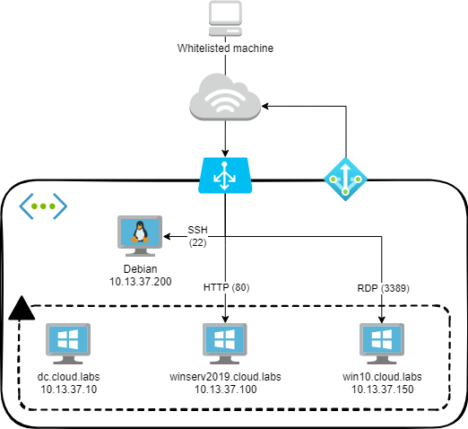

# Cloud Labs AD

Provisioning scripts for an Active Directory lab environment. Designed to be deployed to Azure using the Azure cloud shell. Very alpha.

## Setup

The lab is provisioned automatically using Terraform and Ansible. First, Terraform deploys all the infrastructure and prepares the machines for provisioning. It then kicks off a role-based Ansible playbook from the Debian machine to provision the Windows-based machines.

### Deployment

- Clone the repo to your Azure cloud shell. It conveniently has all you need (Ansible, Terraform, authenticated Azure command line)
- Copy `terraform.tfvars.example` to `terraform.tfvars` in the `Terraform` directory, and configure the variables appropriately
- Add the private key for the specified `public-key` to SSH-agent (``eval `ssh-agent`; ssh-add ~/.ssh/id_rsa``)
- In the same directory, run `terraform init`
- When you're ready to deploy, run `terraform apply` (or `terraform apply --auto-approve` to skip the approval check)

### Post-Deployment Configuration

- If you want to use ADCS, you have to RDP to the DC and follow the post-deployment configuration steps to activate ADCS and the ADCS web enrolment endpoint. Make sure to enable the 'Certification Authority', 'Certification Authority Web Enrollment', and 'Certificate Enrollment Web Service' role services (you can leave the default settings otherwise).

### Removal

- When you're done with the labs, run `terraform destroy` to tear down the environment

## Labs

The labs consist of a selection of machines:

- Windows Server 2016 DC
    - Active Directory Certificate Services (ADCS) installed
- Windows Server 2019
    - Internet Information Servicies (IIS) web server with simple vulnerable app
- Windows 10 client
- Debian attacker box

One public IP is exposed for the whole lab. The IP ranges defined in the `ip-whitelist` are allowed to access the following ports on this IP address, which are bound to the following services using a load balancer:

- Port 22   -> Debian attacker box SSH
- Port 80   -> Windows Server 2019 IIS web server
- Port 3389 -> Windows 10 Client RDP

Another public IP is used for outbound Internet connectivity for all lab machines.

## Wishlist

At a later point I might add the following:
- Advanced logging settings on Windows machines
- EDR / SIEM on Windows machines
- Exchange Server + Microsoft Office on Win10 machine